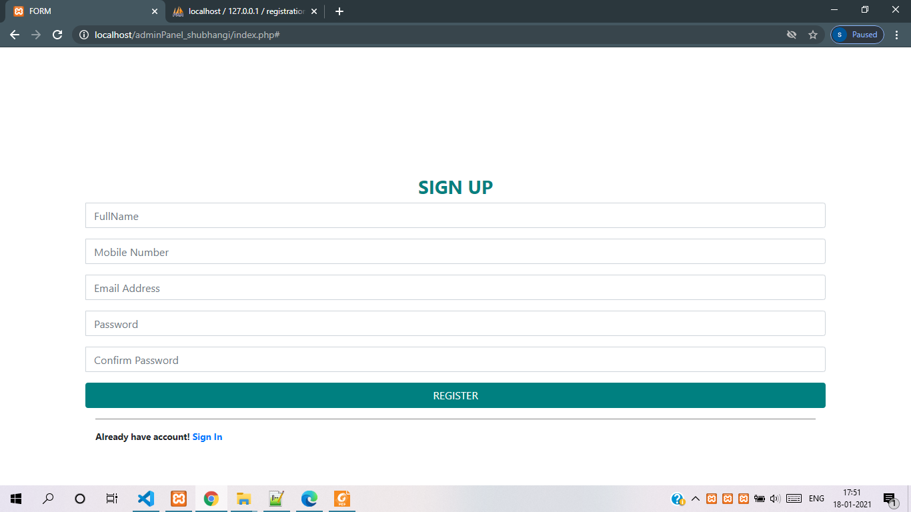
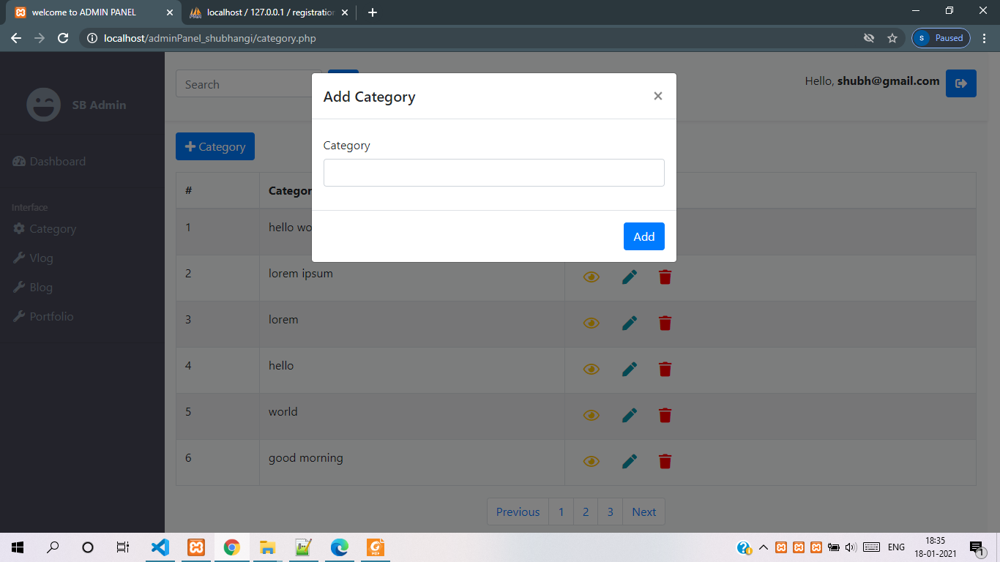
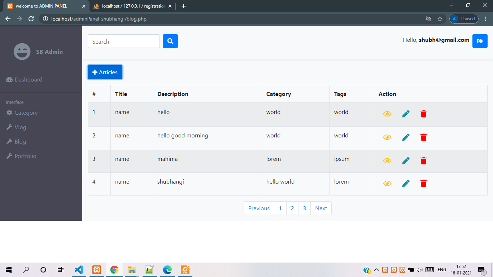
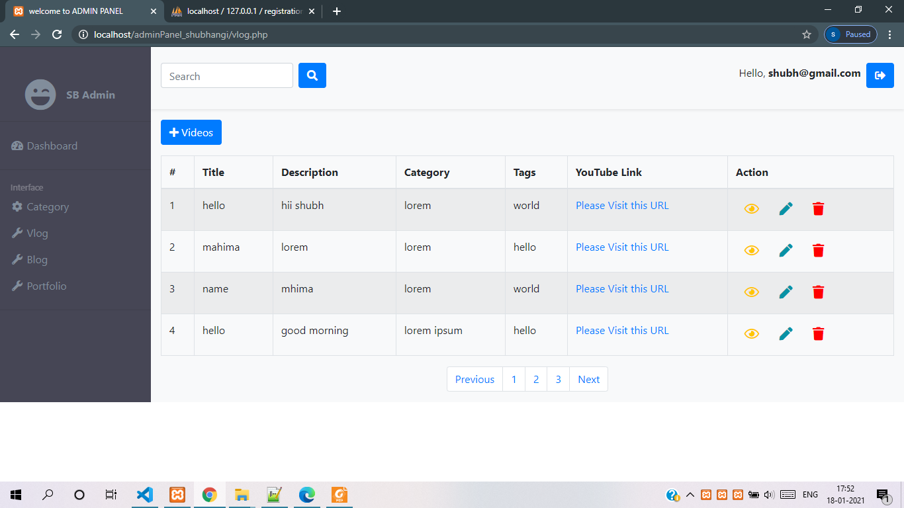
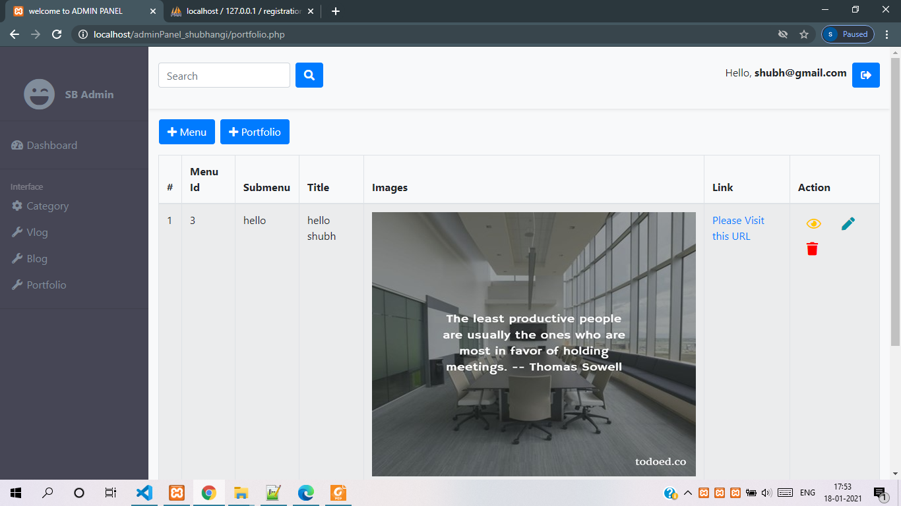
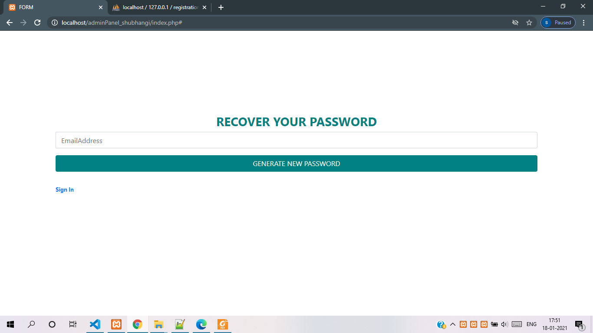

# CRUD aahrat backend Documentation
---

### Introduction

This project is based on CRUD functionality. It is generally used for Dashboard of any website, where admin can control blog/vlog of website by updating, deleting or creating.

### Directory Structure

- admin_panel
  - assets
    - css
    - images
    - js
  - classes
    - Blog.php
    - Category.php
    - Portfolio.php
    - Users.php
    - Vlog.php
  - config
    - config.php
    - credential.php
    - Dbconnect.
  - layout
    - scripts.php
    - sidebar.php
    - style.php
  - library
     - mailer
     - PHPMailerAutoload.php
  - action.php
  - blog.php
  - category.php
  - index.php
  - logout.php
  - portfolio.php
  - verify.php
  - vlog.php

  ### Database Structure
  - registration_db
    - users
          - This table is used for signUp, signIn and for recovery password.
    - blog
          - This table is used for adding blog data.
    - vlog
          - This table is used for adding vlog data.
    - category
          - This table is used for adding data into database,and further we get into vlog and blog category field.
    - portfolio_submenu
          - This table is used for inserting data into database and further we get data into portflio_data (submenu_name).
    - portfolio_data
         - This table is used for adding information about the submenu_name.

  ### LANGUAGES USED AND ITS VERSION

   1. HTML 5
   2. CSS 3
   3. BOOTSTRAP 4.5.2
   4. JQUERY 3.4.1
   5. OOPS PHP
   6. JAVASCRIPT
   7. MYSQL

   # Overall Description
   ---

   ### Objectives
   The main objective of this project to create a dashboard for admin of Aahrat iserve, so that admin can easily handle the aahrat iserve website.

   ### Structure and Functionality:

    - sign up
    - sign In
      - category.php
      - blog.php
      - vlog.php
      - portfolio.php
    - recovery password

   ##### 1) sign up

    

    ###### code description:
    1). The code of signUp is in **index.php**,with class name **sign-up**.
    2). The database table name is **users** with class name is **Users.php** in php.
    3).This page is used for registration purpose, where users can registered the information, so that they can login into dashboard.
    4).PhpMailer is used for activation  of  account through email.

  ##### 2) sign In

   

    ###### code description:
    1). The code of signIn is in **index.php**,with class name **sign-in**.
    2). The database table name is **users** with class name is **Users.php** in php.
    3).This page is used for login purpose, where admin can enter into dashboard page.

  ##### 3) category

   

    ###### code description:
    1). The code of category page is in **category.php**.
    2). The database table name is **category** with class name is **Category.php** in php.
    3). In this page admin can insert, view, delete or update category data as per required.

  ##### 4) blog

   

    ###### code description:
    1). The code of blog page is in **blog.php**.
    2). The database table name is **blog** with class name is **Blog.php** in php.
    3). In this page admin can insert, view, delete or update blog data as per required.

  ##### 5) vlog

   

    ###### code description:
    1). The code of vlog page is in **vlog.php**.
    2). The database table name is **vlog** with class name is **Vlog.php** in php.
    3). In this page admin can insert, view, delete or update vlog data as per required.

  ##### 5) portfolio

   

    ###### code description:
    1). The code of portfolio page is in **portfolio.php**.
    2). The database table name is **portfolio_submenu** and **portfolio_data** with class name is **Portfolio.php** in php.
    3). In this page admin can insert, view, delete or update portfolio data as per required.

  ##### 6) recovery password

   

    ###### code description:
    1). The code of recoveryPassword page is in **index.php**.
    2). The database table name is **users**with class name is **Users.php** in php.
     3).This page is used for recovery of password, where admin can recover password if they forgot.

### Reference

    1) https://www.w3schools.com/
    2) https://www.tutorialspoint.com/javascript/index.html
    3) https://www.w3schools.com/sql/
    4) https://stackoverflow.com/questions/...
    5) https://www.tutorialspoint.com/jquery/index.htm
    6) https://www.w3schools.com/php/

